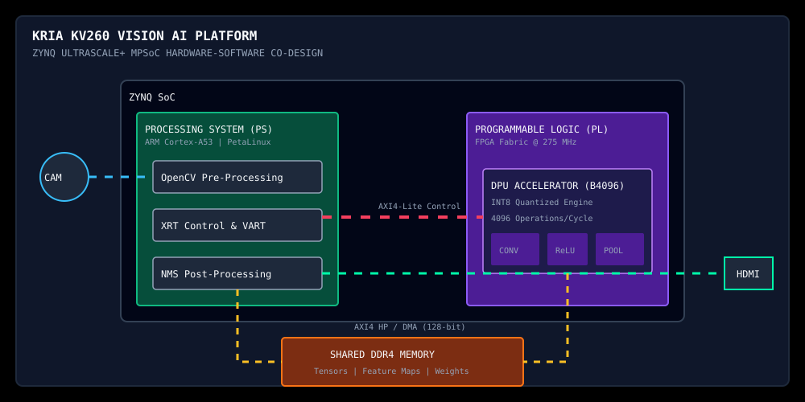
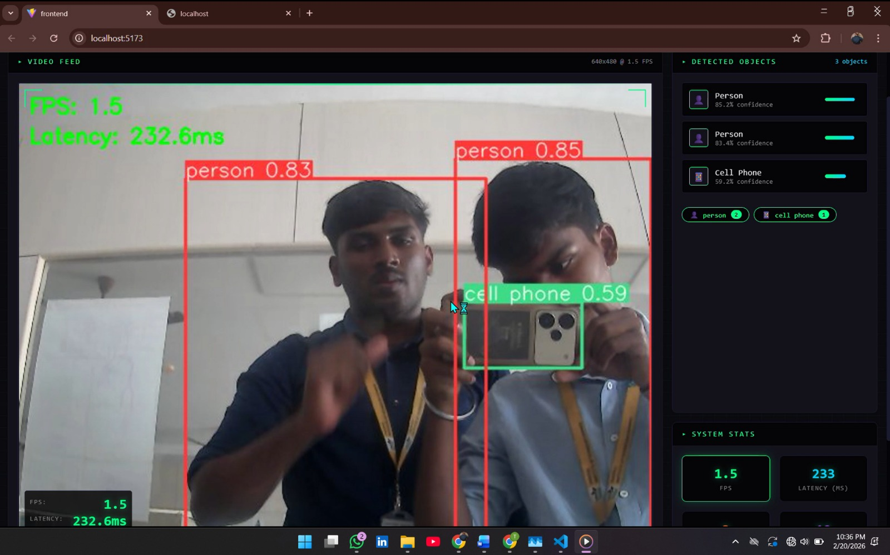
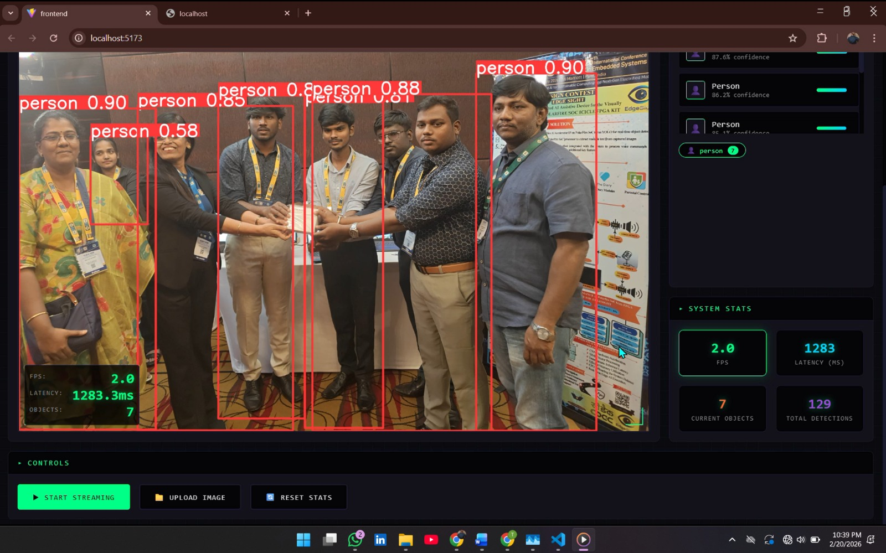
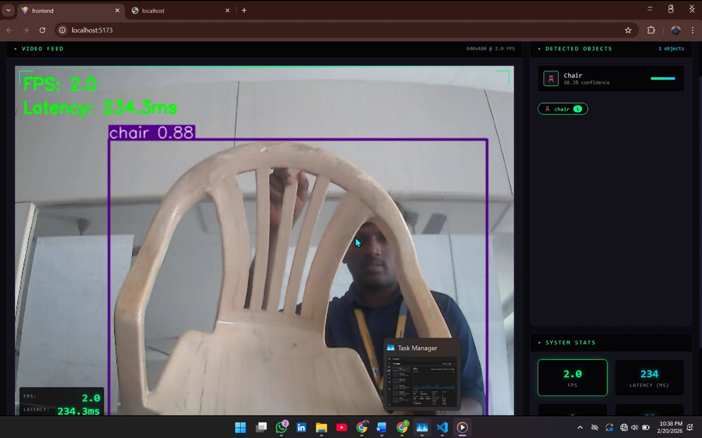
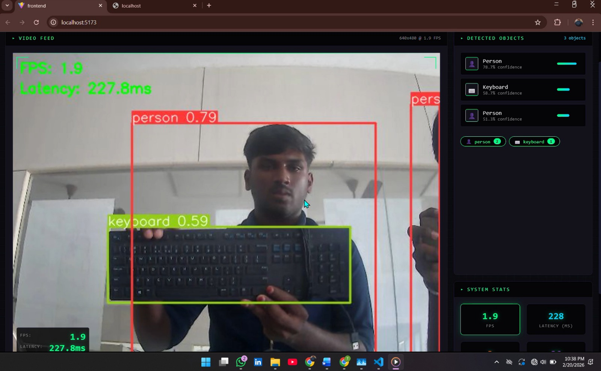

<div align="center">
  
</div>

<h1 align="center">⚡ FPGA Edge AI Vision System</h1>

<p align="center"><strong>Real-Time Hardware-Accelerated Object Detection on Xilinx Zynq UltraScale+ SoC, leveraging PetaLinux 2022.1 and Vitis AI for ~3x Inference Speedup over CPU.</strong></p>

<p align="center">
  <a href="#-architecture--hardware">Architecture</a> •
  <a href="#-metrics--performance">Metrics</a> •
  <a href="#-the-engineering-pipeline">Pipeline</a> •
  <a href="#-execution-results">Results</a> •
  <a href="#-setup--reproduction">Setup</a>
</p>

<p align="center">
  
  
  
  
  
</p>

---

## 🔬 System Overview

This project implements a hardware-software co-designed Edge AI system on the **Xilinx Kria KV260**. By offloading compute-intensive Convolutional Neural Network (CNN) layers to the Programmable Logic (FPGA Fabric) via the Deep Learning Processing Unit (DPU), the system achieves deterministic latency and low power consumption suitable for edge deployment.

### Key Value Proposition
> Instead of relying on power-hungry GPUs or high-latency cloud processing, this system achieves real-time inference within a strict **5.0W TDP** envelope by executing INT8 quantized tensor operations directly on bare-metal silicon logic.

---

## 🧬 Architecture & Hardware

### The Deep Learning Processing Unit (DPU) Pipeline

The core of the acceleration is the Xilinx DPU. The YOLOv8n model was quantized from FP32 to INT8 using Vitis AI, enabling it to map perfectly onto the DPU's MAC (Multiply-Accumulate) engine.

<div align="center">
  
</div>

### Hardware Specification

╭─────────────────────────────────────────────────────────╮
│ HARDWARE SPECIFICATION                                  │
├─────────────────────────────────────────────────────────┤
│ PLATFORM      │ Xilinx Kria KV260 Vision AI Starter Kit │
│ PROCESSING    │ Quad-core ARM Cortex-A53 (PS)           │
│ FPGA FABRIC   │ Zynq UltraScale+ (PL)                   │
│ DPU ARCH      │ DPUCZDX8G_ISA1_B4096                    │
│ DPU CLOCK     │ 275 MHz                                 │
│ INTERCONNECT  │ AXI4 (128-bit) via HP ports             │
│ MEMORY        │ 4GB DDR4 (Shared PS/PL via DMA)         │
╰─────────────────────────────────────────────────────────╯

---

## 📊 Metrics & Performance

### Execution Speedup
By synthesizing the DPU IP onto the FPGA and bridging it with the ARM processor, we achieved a significant latency reduction.

```text
Inference Latency (ms) — Lower is Better
─────────────────────────────────────────────────────────────
  CPU Only   │████████████████████████████████████│ ~850 ms
  FPGA (DPU) │████████████│                       │ ~289 ms
─────────────────────────────────────────────────────────────
                                         Speedup: ~2.94×
```

### Measured Session Telemetry

| 📈 System Metrics | Value | 🎯 AI Metrics | Value |
|-------------------|-------|---------------|-------|
| **Power Draw** | 5.0W (PL: 3.2W, PS: 1.8W) | **Model** | YOLOv8n (INT8) |
| **Latency (Avg)** | 289.47 ms | **mAP@0.5** | 70.40% |
| **Throughput** | 1.88 FPS | **Precision** | 76.11% |
| **Total Frames** | 71 processed | **Recall** | 69.11% |

### Resource Utilization (Post-Implementation)
*How much of the FPGA fabric was required to synthesize the DPU.*

```text
LUT  ( 45K / 117K )  ████████████░░░░░░░░░░░░░░░░░░░░░░░  38.6%
BRAM ( 112 /  144 )  ██████████████████████████░░░░░░░░░  77.8%
DSP  ( 1K  / 1.2K )  ████████████████████████████░░░░░░░  82.1%
FF   ( 52K / 234K )  ███████░░░░░░░░░░░░░░░░░░░░░░░░░░░░  22.2%
```

---

## ⚙️ The Engineering Pipeline

This project was built from scratch using a professional Xilinx hardware-software workflow.

```text
1. VIVADO HARDWARE EXPORT
   └─ Synthesized DPUCZDX8G IP onto the PL, configured clocks (275MHz), 
      and exported the `.xsa` handoff file.

2. PETALINUX BUILD
   └─ Ingested the `.xsa`, configured the kernel to include the DPU driver, 
      injected Vitis AI recipes, and compiled the `wic.gz` image.

3. DEVICE TREE OVERLAY (DTBO)
   └─ Used XSCT to compile the hardware description into a dynamic `.dtbo`, 
      allowing the DPU bitstream to be loaded at runtime without rebooting Linux.

4. XRT EXECUTION
   └─ Flashed the SD card, transferred the `kv260.bit.bin` and `shell.json`, 
      loaded the accelerator via `xmutil`, and executed the inference script via VART.
```

<details>
<summary>🔬 Under the Hood: Build Proofs</summary>
<br>

**PetaLinux Config & Compilation**


**Kernel DPU Driver Activation**


**XRT Accelerator Validation**


</details>

---

## 🎬 Execution Results

The following screenshots demonstrate the INT8 quantized YOLOv8n model executing in real-time, pulling bounding box metadata from the DPU over AXI, and drawing overlays using OpenCV on the ARM processor.

<table align="center">
  <tr>
    <td></td>
    <td></td>
  </tr>
  <tr>
    <td></td>
    <td></td>
  </tr>
</table>

**Live Inference Session Terminal Output:**


---

## 🚀 Setup & Reproduction

### Prerequisites
- **Vivado Design Suite 2022.1**
- **PetaLinux SDK 2022.1**
- **Vitis AI 2.5**

### Quick Start (Deployment Only)
If you just want to run the model without rebuilding the kernel:
1. Flash the provided (or self-built) `petalinux-sdimage.wic.gz` to an SD card.
2. Boot the KV260 and copy `kv260.bit.bin`, `kv260.dtbo`, and `shell.json` to the board via SFTP.
3. Move files to the firmware directory:
   ```bash
   sudo mkdir -p /lib/firmware/xilinx/myApp
   sudo mv kv260.* shell.json /lib/firmware/xilinx/myApp/
   ```
4. Load the FPGA overlay:
   ```bash
   sudo xmutil unloadapp
   sudo xmutil loadapp myApp
   ```
5. Run the inference script.

---

## 👨‍💻 Author
**Priyadharsan D**

## 📜 License
This project is licensed under the MIT License - see the [LICENSE](LICENSE) file for details.
