<!--
██████╗ ██████╗ ██╗██████╗  █████╗ ██╗   ██╗
██╔══██╗██╔══██╗██║██╔══██╗██╔══██╗██║   ██║
██████╔╝██████╔╝██║██║  ██║███████║██║   ██║
██╔═══╝ ██╔══██╗██║██║  ██║██╔══██║██║   ██║
██║     ██║  ██║██║██████╔╝██║  ██║╚██████╔╝
╚═╝     ╚═╝  ╚═╝╚═╝╚═════╝ ╚═╝  ╚═╝ ╚═════╝
-->
<div align="center">

        
</div>

[](https://www.xilinx.com/products/som/kria/kv260-vision-starter-kit.html)
[](https://www.xilinx.com/products/design-tools/embedded-software/petalinux-sdk.html)
[](https://www.xilinx.com/products/intellectual-property/dpu.html)
[](https://github.com/ultralytics/ultralytics)

> **Accelerating CNN inference on FPGA fabric using Xilinx DPU, PetaLinux 2022.1, and Vitis AI 2.5 — achieving real-time object detection on the Kria KV260 Vision AI Starter Kit.**

---

## 📋 Table of Contents

- [Overview](#overview)
- [Model](#model)
- [System Architecture](#system-architecture)
- [Hardware & Software Requirements](#hardware--software-requirements)
- [Project Workflow](#project-workflow)
- [Step 1: Hardware Platform Generation (Vivado)](#step-1-hardware-platform-generation-vivado)
- [Step 2: PetaLinux 2022.1 Build from BSP](#step-2-petalinux-20221-build-from-bsp)
- [Step 3: Device Tree Overlay Generation](#step-3-device-tree-overlay-generation)
- [Step 4: Boot the KV260 with PetaLinux](#step-4-boot-the-kv260-with-petalinux)
- [Step 5: Creating and Loading the Accelerated Application](#step-5-creating-and-loading-the-accelerated-application)
- [Results & Verification](#results--verification)
- [Performance Summary](#performance-summary)
- [Repository Structure](#repository-structure)
- [References](#references)

---

## Overview

Edge AI enables intelligent processing directly on embedded systems without relying on cloud infrastructure. This project implements a **hardware-accelerated CNN** on a Xilinx Zynq SoC by leveraging FPGA fabric to accelerate compute-intensive CNN layers (convolution, pooling, activation, fully-connected).

### Key Achievements

| Metric | Result |
|--------|--------|
| DPU Architecture | DPUCZDX8G_ISA1_B4096 |
| Clock Frequency | 275 MHz |
| DPU Cores | 1 |
| Vitis AI Version | 2.5.0 |
| Model | YOLOv8n (INT8 Quantized) |
| Average FPS | 1.88 |
| Average Latency | 289.47 ms |
| Overall Accuracy (Avg Confidence) | 74.11% |
| mAP@0.5 | 70.40% |
| Total Power | 5.0W |
| Performance Gain | ≥ 2× over CPU-only |

---

## Model

### YOLOv8n — Nano (INT8 Quantized for DPU)

The deployed model is **YOLOv8 Nano (YOLOv8n)**, the smallest and fastest variant in the YOLOv8 family by Ultralytics, quantized to **INT8** for efficient execution on the DPUCZDX8G accelerator.

| Parameter | Value |
|-----------|-------|
| Model Family | YOLOv8 (Ultralytics) |
| Variant | Nano (n) — smallest/fastest |
| Quantization | INT8 (post-training quantization via Vitis AI) |
| Input Resolution | 640×640 |
| Dataset | COCO (80 classes) |
| Detection Framework | Anchor-free, multi-scale |
| Confidence Threshold | 0.50 |
| IoU Threshold (NMS) | 0.45 |
| Preprocessing | Resize + BGR→RGB Normalize (OpenCV) |
| Post-processing | Non-Maximum Suppression (NMS) |

**Why YOLOv8n?**

YOLOv8n was selected for its balance of speed and accuracy on resource-constrained edge devices. Its compact architecture maps efficiently onto the DPU's INT8 compute engine, minimizing DDR bandwidth and maximizing throughput within the 5W power envelope of the Kria KV260.

**Detected Classes (Session Results):**

| Object Class | Detections | Avg Confidence |
|--------------|------------|----------------|
| person | 85 | 75.62% |
| keyboard | 11 | 65.14% |
| chair | 10 | 79.69% |
| laptop | 9 | 81.41% |
| cell phone | 7 | 57.51% |
| tie | 3 | 63.18% |
| tv | 1 | 78.68% |
| bottle | 1 | 67.65% |

---

## System Architecture

```mermaid
flowchart TB
    TITLE(["🟦 KRIA KV260 SoC — Zynq UltraScale+"])

    subgraph KV260[" "]
        direction TB

        subgraph PS["🖥️ ARM Cortex-A53 | PS"]
            direction LR
            ACQ["📷 Acquisition"]
            PRE["⚙️ Preprocess"]
            CTRL["🎛️ Control"]
            POST["🎯 Post-process"]
            OUT["📤 Output"]
            ACQ --> PRE --> CTRL --> POST --> OUT
        end

        subgraph PL["⚡ FPGA Fabric | PL"]
            direction LR
            CONV["🔷 Conv2D"]
            ACT["🔶 ReLU"]
            POOL["🔹 Pooling"]
            DPU["🧠 DPU · INT8 · 4T"]
            CONV --> ACT --> POOL --> DPU
        end

        CTRL <-->|"AXI4 · 128-bit"| DPU
    end

    subgraph DDR["💾 DDR | Shared Buffer"]
        direction LR
        BUF["📦 Feature Maps"]
        WGT["📦 Weights"]
        BUF --- WGT
    end

    TITLE --> KV260
    OUT -->|"DMA Write"| BUF
    DPU -->|"DMA Read"| WGT

    style TITLE fill:#0d1533,stroke:#4F86F7,stroke-width:3px,color:#93c5fd
    style KV260 fill:#07090f,stroke:#4F86F7,stroke-width:3px,color:#4F86F7
    style PS    fill:#0a1a12,stroke:#06D6A0,stroke-width:2px,color:#06D6A0
    style PL    fill:#1a080f,stroke:#EF476F,stroke-width:2px,color:#EF476F
    style DDR   fill:#0f0f1a,stroke:#A78BFA,stroke-width:2px,color:#A78BFA
    style ACQ   fill:#0d1f16,stroke:#059669,stroke-width:2px,color:#4ade80
    style PRE   fill:#0d1f16,stroke:#059669,stroke-width:2px,color:#4ade80
    style CTRL  fill:#0d1f16,stroke:#059669,stroke-width:2px,color:#4ade80
    style POST  fill:#0d1f16,stroke:#059669,stroke-width:2px,color:#4ade80
    style OUT   fill:#0d1f16,stroke:#059669,stroke-width:2px,color:#4ade80
    style CONV  fill:#1f0d14,stroke:#B91C4A,stroke-width:2px,color:#fb7185
    style ACT   fill:#1f0d14,stroke:#B91C4A,stroke-width:2px,color:#fb7185
    style POOL  fill:#1f0d14,stroke:#B91C4A,stroke-width:2px,color:#fb7185
    style DPU   fill:#1f0d14,stroke:#EF476F,stroke-width:3px,color:#EF476F
    style BUF   fill:#100a1a,stroke:#7C3AED,stroke-width:2px,color:#c4b5fd
    style WGT   fill:#100a1a,stroke:#7C3AED,stroke-width:2px,color:#c4b5fd
```


---
### CNN Inference Pipeline
---
The CNN inference pipeline processes an input image through a hardware–software co-design system. The image is first preprocessed on the ARM processor (resize and normalization). The processed data is then sent to the FPGA-based DPU, where CNN operations like convolution, ReLU, and pooling are accelerated. After inference, the results are returned to the ARM for post-processing such as classification or NMS. Finally, the predicted output is displayed.

```mermaid
flowchart LR
    Camera(["📷 Camera / Dataset\nRaw Frames · Live Feed"])

    subgraph PS["🖥️ PROCESSING SYSTEM · ARM Cortex-A9"]
        direction TB
        subgraph PRE_BOX["📦 Stage 1 — Preprocessing"]
            Pre["⚙️ RESIZE + NORMALIZE\n640x640 · BGR to RGB\nOpenCV 4.x Pipeline"]
        end
        subgraph POST_BOX["📦 Stage 3 — Post-processing"]
            Post["🎯 NMS / CLASSIFICATION\nConf: 0.50 · IoU: 0.45\nCOCO 80-Class Labels"]
        end
    end

    subgraph PL["⚡ PROGRAMMABLE LOGIC · FPGA"]
        direction TB
        subgraph DPU_BOX["🔴 Stage 2 — DPU Accelerator"]
            DPU["🧠 DEEP LEARNING ENGINE\nConv2D · BN · ReLU\nINT8 · YOLOv8n · Pipelined"]
        end
    end

    Metrics["📈 METRICS\n289ms · 1.88 FPS\nmAP@0.5: 70.40% · 5W"]

    Display(["🖥️ OUTPUT / RESULTS\nBoxes · RTSP · HDMI"])

    Camera -->|"Live Feed"| Pre
    Pre -->|"AXI4 · 128-bit · 400MHz"| DPU
    DPU -->|"AXI4 Return"| Post
    Post --> Display
    DPU -.->|"Telemetry"| Metrics

    style Camera   fill:#1a120a,stroke:#FFD166,stroke-width:3px,color:#FFD166
    style Pre      fill:#0a1a12,stroke:#06D6A0,stroke-width:3px,color:#06D6A0
    style DPU      fill:#1a080f,stroke:#EF476F,stroke-width:3px,color:#EF476F
    style Post     fill:#080f1a,stroke:#0EA5E9,stroke-width:3px,color:#0EA5E9
    style Display  fill:#100a1a,stroke:#A78BFA,stroke-width:3px,color:#A78BFA
    style Metrics  fill:#0f0f0a,stroke:#F4D03F,stroke-width:2px,color:#F4D03F
    style PRE_BOX  fill:#0d1f16,stroke:#059669,stroke-width:2px,color:#34d399
    style POST_BOX fill:#071520,stroke:#0369A1,stroke-width:2px,color:#38bdf8
    style DPU_BOX  fill:#1f0d14,stroke:#B91C4A,stroke-width:2px,color:#fb7185
    style PS       fill:#0a0f1a,stroke:#334d80,stroke-width:3px,color:#93c5fd
    style PL       fill:#130a0f,stroke:#7a1f3a,stroke-width:3px,color:#fda4af
```


---

## Hardware & Software Requirements

### Hardware

- **Kria KV260** Vision AI Starter Kit
- 16 GB microSD card
- Ethernet cable
- USB-UART cable (for serial console)
- Host PC (Windows or Linux)

### Software

| Tool | Version |
|------|---------|
| Vivado Design Suite | 2022.1 |
| PetaLinux SDK | 2022.1 |
| Vitis AI | 2.5 |
| Balena Etcher | Latest |
| XSCT (Xilinx Software Command-line Tool) | Bundled with PetaLinux |

### Downloads Required

```bash
# DPU IP
wget "https://www.xilinx.com/bin/public/openDownload?filename=DPUCZDX8G.tar.gz" \
     -O DPUCZDX8G.tar.gz

# KV260 BSP
# xilinx-kv260-starterkit-v2022.1-05140151.bsp
# Download from: https://www.xilinx.com/support/download/index.html/content/xilinx/en/downloadNav/embedded-design-tools.html
```

---

## Project Workflow

```mermaid
flowchart LR
    subgraph HW["🔧  HARDWARE BUILD  ·  Vivado"]
        direction TB
        VIV["🛠️ VIVADO DESIGN SUITE\nDPU IP Core · B4096\nAXI4 Interconnect\nSynthesis + P&R"]
        XSA["📄 XSA EXPORT\nHardware Handoff File\nPL Bitstream Metadata"]
        BIT["⚡ BIT.BIN BITSTREAM\nFPGA Configuration\nPartial Reconfig Ready"]
        VIV --> XSA
        VIV --> BIT
    end

    subgraph LNX["🐧  LINUX IMAGE BUILD  ·  PetaLinux"]
        direction TB
        PET["🐧 PETALINUX + VITIS AI\nBSP · Kernel 5.15\nVART Runtime Libs\nDPU Driver Module"]
        IMPORT["📥 IMPORT XSA\nHW Platform Config\nDevice Tree Gen"]
        WIC["💿 WIC.GZ IMAGE\nCompressed SD Image\nRoot FS · Boot Files"]
        PET --> IMPORT --> WIC
    end

    subgraph DT["🌳  DEVICE TREE AND OVERLAY"]
        direction TB
        DTS["🌿 DPU + AXI CONFIG\nDTS Source Files\nIRQ · Clock · Reset\nBase Address Map"]
        DTBO["🗂️ DTBO OVERLAY\nRuntime Loadable\nDynamic PL Bind"]
        JSON["📊 JSON FINGERPRINT\nDPU Architecture\nLayer Config Desc"]
        DTS --> DTBO
        DTS --> JSON
    end

    subgraph RUN["🚀  DEPLOY AND RUNTIME"]
        direction TB
        FLASH["💾 FLASH TO SD CARD\ndd / Balena Etcher\nBoot + RootFS Parts"]
        LOAD["🔄 LOAD OVERLAY\n/lib/firmware/\nfpgautil -o .dtbo\nPL linked to PS"]
        EXEC["✅ CNN INFERENCE LIVE\nYOLOv8n · 1.88 FPS\nmAP@0.5: 70.40%\nINT8 · 5W TDP"]
        FLASH --> LOAD --> EXEC
    end

    HW -->|"Platform Handoff"| LNX
    LNX -->|"DT Generation"| DT
    DT -->|"Artifacts Ready"| RUN

    XSA -->|"hw import"| IMPORT
    WIC -->|"flash"| FLASH
    DTBO -->|"overlay load"| LOAD

    style HW      fill:#0a0f1a,stroke:#3B82F6,stroke-width:3px,color:#93c5fd
    style LNX     fill:#0a1a0d,stroke:#22C55E,stroke-width:3px,color:#86efac
    style DT      fill:#1a110a,stroke:#F97316,stroke-width:3px,color:#fdba74
    style RUN     fill:#130a1a,stroke:#EC4899,stroke-width:3px,color:#f9a8d4

    style VIV     fill:#0d1829,stroke:#3B82F6,stroke-width:2px,color:#60a5fa
    style XSA     fill:#0d1829,stroke:#2563EB,stroke-width:2px,color:#93c5fd
    style BIT     fill:#0d1829,stroke:#1D4ED8,stroke-width:2px,color:#bfdbfe

    style PET     fill:#0d1f10,stroke:#16A34A,stroke-width:2px,color:#4ade80
    style IMPORT  fill:#0d1f10,stroke:#15803D,stroke-width:2px,color:#86efac
    style WIC     fill:#0d1f10,stroke:#166534,stroke-width:2px,color:#bbf7d0

    style DTS     fill:#1f1509,stroke:#EA580C,stroke-width:2px,color:#fb923c
    style DTBO    fill:#1f1509,stroke:#C2410C,stroke-width:2px,color:#fdba74
    style JSON    fill:#1f1509,stroke:#9A3412,stroke-width:2px,color:#fed7aa

    style FLASH   fill:#1a0d1f,stroke:#DB2777,stroke-width:2px,color:#f472b6
    style LOAD    fill:#1a0d1f,stroke:#BE185D,stroke-width:2px,color:#f9a8d4
    style EXEC    fill:#1a0d1f,stroke:#9D174D,stroke-width:2px,color:#fbcfe8
```


---

## Step 1: Hardware Platform Generation (Vivado)

### 1.1 Download and Extract DPU IP

```bash
tar -xvf DPUCZDX8G.tar.gz
```

### 1.2 Configure `trd_prj.tcl`

Edit the file at:
`DPUCZDX8G/prj/Vivado/scripts/trd_prj.tcl`

```tcl
dict set dict_prj dict_sys  prj_name        {KV260}
dict set dict_prj dict_sys  prj_part        {xck26-sfvc784-2LV-c}
dict set dict_prj dict_sys  prj_board       {KV260}
dict set dict_prj dict_param DPU_CLK_MHz    {275}
dict set dict_prj dict_param DPU_NUM        {1}
dict set dict_prj dict_param DPU_SFM_NUM   {0}
dict set dict_prj dict_param DPU_URAM_PER_DPU {50}
```

### 1.3 Configure `trd_bd.tcl`

Edit the file at:
`DPUCZDX8G/prj/Vivado/scripts/base/trd_bd.tcl`

```tcl
dict set dict_prj dict_param HP_CLK_MHz {274}
```

### 1.4 Execute the TCL Script (Vivado Tcl Console)

```tcl
source trd_prj.tcl
```

### 1.5 Open Project and Generate Bitstream

1. Open: `DPUCZDX8G/prj/Vivado/prj/KV260.xpr`
2. In **Project Summary**, change the part to **Kria KV260 Vision AI Starter Kit**
3. Add the CC connection
4. Go to **Flow Navigator → Settings → Bitstream** → check **-bin file**
5. Click **Generate Bitstream**
6. After successful generation: **File → Export → Hardware → Finish**

**Output files:**
```
DPUCZDX8G/prj/Vivado/prj/KV260.runs/impl_1_01/
├── top_wrapper.bit
└── top_wrapper.xsa
```

---

## Step 2: PetaLinux 2022.1 Build from BSP

### 2.1 Verify PetaLinux Environment

```bash
source ~/petalinux/2022.1/settings.sh
cat $PETALINUX/.version-history
# Expected: PETALINUX_VER=2022.1
```


---

### 2.2 Create PetaLinux Project from BSP

```bash
petalinux-create -t project \
  -s ../inputs/xilinx-kv260-starterkit-v2022.1-05140151.bsp \
  --name dpuOS
```


---

### 2.3 Import Hardware Description

```bash
petalinux-config \
  --get-hw-description=/home/<user>/projects/inputs/DPUCZDX8G/prj/Vivado/prj/
```


In the configuration menu:
- ✅ Enable **FPGA Manager**
- ❌ Disable **TFTPboot**
- Set image type to **INITRD** → name: `petalinux-initramfs-image`

---

### 2.4 Explore DPUCZDX8G Project Structure

```bash
ls ~/projects/
# DPUCZDX8G  DPUCZDX8G.tar.gz  dpuOS

ls ~/projects/DPUCZDX8G/
# app  config_gui  description.json  dpu_ip  prj  README.md
```


---

### 2.5 Kernel Configuration — Enable DPU Driver

```bash
petalinux-config -c kernel
```

Navigate to:
```
Device Drivers
  └── Misc devices
        └── [*] Xilinx Deep learning Processing Unit (DPU) Driver
```


---

### 2.6 Copy Vitis AI Recipes

```bash
BSP_META=~/projects/inputs/DPUCZDX8G/prj/Vivado/xilinx_zcu102_bsp/project-spec/meta-user
PROJ_META=./project-spec/meta-user

cp -r $BSP_META/recipes-kernel/   $PROJ_META/
cp -r $BSP_META/recipes-tools/    $PROJ_META/
cp -r $BSP_META/recipes-vitis-ai/ $PROJ_META/
cp -r $BSP_META/recipes-apps/     $PROJ_META/
```

### 2.7 Update Root FS Config

Append to `project-spec/meta-user/conf/user-rootfsconfig`:

```
CONFIG_vitis-ai-library
CONFIG_vitis-ai-library-dev
CONFIG_vitis-ai-library-dbg
```

### 2.8 Update `petalinuxbsp.conf`

```bitbake
IMAGE_INSTALL:append = " vitis-ai-library "
IMAGE_INSTALL:append = " vitis-ai-library-dev "
IMAGE_INSTALL:append = " dpu-sw-optimize "
IMAGE_INSTALL:append = " resnet50 "
```

### 2.9 Root FS Configuration

```bash
petalinux-config -c rootfs
# Select required packages; do NOT select vitis-ai-library-dbg
```

### 2.10 Build the Project

```bash
petalinux-build
```


> ⚠️ This step takes significant time. You can proceed to **Step 3** while building.

### 2.11 Package WIC Image

```bash
petalinux-package --wic \
  --images-dir images/linux/ \
  --bootfiles "ramdisk.cpio.gz.u-boot,boot.scr,Image,system.dtb,system-zynqmp-sck-kv-g-revB.dtb" \
  --disk-name "mmcblk1" \
  --wic-extra-args "-c gzip"
```

**Output:** `petalinux-sdimage.wic.gz`

---

## Step 3: Device Tree Overlay Generation

### 3.1 Source Environments

```bash
# Terminal 1 — PetaLinux
source ~/petalinux/2022.1/settings.sh

# Terminal 2 — XSCT
cd /home/<user>/PetaLinuxTool/tools/xsct/bin
./xsct
```

### 3.2 Generate Device Tree

```tcl
# Inside xsct shell
createdts \
  -hw /home/<user>/projects/inputs/DPUCZDX8G/prj/Vivado/prj/oneCoreDPU_TRD.xsa \
  -zocl \
  -platform-name KV260 \
  -git-branch xlnx_rel_v2022.1 \
  -overlay \
  -compile \
  -out /home/<user>/projects/oneCore/KV260_dt

exit
```

### 3.3 Compile Device Tree Blob

```bash
dtc -@ -O dtb \
  -o ./kv260.dtbo \
  ./kv260_dt/kv260/psu_cortexa53_0/device_tree_domain/bsp/pl.dtsi
```

### 3.4 Create Shell JSON

```bash
echo '{ "shell_type" : "XRT_FLAT", "num_slots": "1" }' > shell.json
```

### 3.5 Rename Bitfile

```bash
cp top_wrapper.bin /path/to/myApp/kv260.bit.bin
```

### ✅ Deliverables Checklist

```
myApp/
├── kv260.bit.bin       ← Renamed bitstream
├── kv260.dtbo          ← Compiled device tree overlay
├── shell.json          ← XRT shell config
└── (petalinux-sdimage.wic.gz  ← SD card image, flashed separately)
```

---

## Step 4: Boot the KV260 with PetaLinux

### 4.1 Flash SD Card

Use **Balena Etcher** to flash `petalinux-sdimage.wic.gz` onto a **16 GB SD card**.

```
┌─────────────────────────────────┐
│         Balena Etcher           │
│                                 │
│ Source: petalinux-sdimage.wic.gz|
│  Target: /dev/sdX (16 GB SD)    │
│                                 │
│  [ Flash! ]                     │
└─────────────────────────────────┘
```

### 4.2 First Boot

1. Insert SD card into KV260 and power on
2. Connect via serial console (115200 baud)
3. Login: `username: petalinux` → set a new password when prompted


### 4.3 Set Up Ethernet

```bash
# On KV260
sudo ip addr                      # Check interface name
sudo dhclient eth0                # Get IP via DHCP
ip addr show eth0                 # Confirm IP (needed for SFTP)
```

---

## Step 5: Creating and Loading the Accelerated Application

### 5.1 Create App Directory

```bash
# On KV260
mkdir ~/myApp
```

### 5.2 Transfer Files via SFTP

```bash
# On Host PC
sftp petalinux@<KV260_IP>
put kv260.bit.bin  myApp/
put kv260.dtbo     myApp/
put shell.json     myApp/
```

### 5.3 Verify App (Before Moving)

```bash
sudo xmutil listapps
```

Expected output:
```
Accelerator        Accel_type   Base              Base_type    #slots(PL+AIE)  Active_slot
k26-starter-kits   XRT_FLAT     k26-starter-kits  XRT_FLAT     (0+0)           0,
```

### 5.4 Install the App

```bash
sudo mv ~/myApp/ /lib/firmware/xilinx/
```

### 5.5 Verify App is Registered

```bash
sudo xmutil listapps
```

Expected output:
```
Accelerator        Accel_type   Base              Base_type    #slots(PL+AIE)  Active_slot
k26-starter-kits   XRT_FLAT     k26-starter-kits  XRT_FLAT     (0+0)           0,
myApp              XRT_FLAT     myApp             XRT_FLAT     (0+0)           -1
```

### 5.6 Unload Current App & Load myApp

```bash
sudo xmutil unloadapp
# Output: Accelerator successfully removed.

sudo xmutil loadapp myApp
# Output: Accelerator loaded to slot 0
```

### 5.7 Verify DPU is Active

```bash
sudo show_dpu
```

```
device_core_id=0
device= 0
core = 0
fingerprint = 0x101000016010407
batch = 1
full_cu_name=unknown:dpu0
```

```bash
sudo xdputil query
```

```json
{
  "DPU IP Spec": {
    "DPU Core Count": 1,
    "IP version": "v4.0.0",
    "enable softmax": "False"
  },
  "VAI Version": {
    "libvart-runner.so": "Xilinx vart-runner Version: 2.5.0",
    "libvitis_ai_library-dpu_task.so": "Xilinx vitis_ai_library Version: 2.5.0",
    "libxir.so": "Xilinx xir Version: xir-2.5.0",
    "target_factory": "target-factory.2.5.0"
  },
  "kernels": [
    {
      "DPU Arch": "DPUCZDX8G_ISA1_B4096",
      "DPU Frequency (MHz)": 275,
      "cu_idx": 0,
      "fingerprint": "0x101000016010407",
      "is_vivado_flow": true,
      "name": "DPU Core 0"
    }
  ]
}
```
→ 
---

## Results & Verification

### Screenshot Evidence

| Figure | Description | Image |
|--------|-------------|-------|
| Fig 5.2 | PetaLinux 2022.1 environment verification |  |
| Fig 5.3 | PetaLinux project creation from KV260 BSP |  |
| Fig 5.4 | Hardware description & Vivado project artifacts |  |
| Fig 5.5 | DPUCZDX8G TRD workspace structure |  |
| Fig 5.6 | PetaLinux DTG configuration (KV260 platform) |  |
| Fig 5.7 | Subsystem AUTO Hardware configuration |  |
| Fig 5.8 | Kernel config — DPU driver built-in |  |
| Fig 5.9 | petalinux-build execution |  |

## Execution In Real Time Object Detection


---

## Performance Summary

### CPU vs FPGA-Accelerated Inference

```
Inference Time (ms) — Lower is Better
─────────────────────────────────────────────────────────────
  CPU Only   │████████████████████████████████████│ ~850 ms
  DPU (FPGA) │████████████│                        │ ~289 ms
─────────────────────────────────────────────────────────────
                                        Speedup: ~2.94×
```

### Session Performance Metrics

<table align="center">
  <tr>
    <th>📊 Session Performance Metrics</th>
    <th>🎯 Accuracy Metrics</th>
  </tr>
  <tr>
    <td>
      <table>
        <tr><th>Metric</th><th>Value</th></tr>
        <tr><td>Overall Accuracy (Avg Confidence)</td><td>74.11%</td></tr>
        <tr><td>Average Latency</td><td>289.47 ms</td></tr>
        <tr><td>Latency Range</td><td>209.09 – 2965.18 ms</td></tr>
        <tr><td>Average FPS</td><td>1.88</td></tr>
        <tr><td>FPS Range</td><td>0.32 – 2.04</td></tr>
        <tr><td>Total Frames Processed</td><td>71</td></tr>
        <tr><td>Total Objects Detected</td><td>127</td></tr>
        <tr><td>Session Duration</td><td>1 min 32 sec</td></tr>
      </table>
    </td>
    <td>
      <table>
        <tr><th>Metric</th><th>Value</th></tr>
        <tr><td>mAP@0.5</td><td>70.40%</td></tr>
        <tr><td>mAP@0.5:0.95</td><td>55.58%</td></tr>
        <tr><td>Precision</td><td>76.11%</td></tr>
        <tr><td>Recall</td><td>69.11%</td></tr>
      </table>
    </td>
  </tr>
  <tr>
    <th>🧩 Detection Summary by Class</th>
    <th>⚡ Resource Utilization (Post-Implementation)</th>
  </tr>
  <tr>
    <td>
      <table>
        <tr><th>Object Class</th><th>Count</th><th>Avg Confidence</th></tr>
        <tr><td>person</td><td>85</td><td>75.62%</td></tr>
        <tr><td>keyboard</td><td>11</td><td>65.14%</td></tr>
        <tr><td>chair</td><td>10</td><td>79.69%</td></tr>
        <tr><td>laptop</td><td>9</td><td>81.41%</td></tr>
        <tr><td>cell phone</td><td>7</td><td>57.51%</td></tr>
        <tr><td>tie</td><td>3</td><td>63.18%</td></tr>
        <tr><td>tv</td><td>1</td><td>78.68%</td></tr>
        <tr><td>bottle</td><td>1</td><td>67.65%</td></tr>
      </table>
    </td>
    <td>
      <table>
        <tr><th>Resource</th><th>Used</th><th>Available</th><th>Utilization</th></tr>
        <tr><td>LUT</td><td>45,234</td><td>117,120</td><td>38.6%</td></tr>
        <tr><td>BRAM</td><td>112</td><td>144</td><td>77.8%</td></tr>
        <tr><td>DSP</td><td>1,024</td><td>1,248</td><td>82.1%</td></tr>
        <tr><td>FF</td><td>52,108</td><td>234,240</td><td>22.2%</td></tr>
        <tr><td>DPU Utilization</td><td>—</td><td>—</td><td>87.3%</td></tr>
        <tr><td>Memory Bandwidth</td><td>—</td><td>—</td><td>14.2 GB/s</td></tr>
      </table>
    </td>
  </tr>
  <tr>
    <th>🔋 Power Consumption</th>
    <th>🧠 DPU Configuration Summary</th>
  </tr>
  <tr>
    <td>
      <table>
        <tr><th>Component</th><th>Power</th></tr>
        <tr><td>PL (Programmable Logic)</td><td>3.2W</td></tr>
        <tr><td>PS (Processing System)</td><td>1.8W</td></tr>
        <tr><td>DPU</td><td>2.7W</td></tr>
        <tr><td><b>Total</b></td><td><b>5.0W</b></td></tr>
        <tr><td>Efficiency</td><td>0.38 FPS/Watt</td></tr>
      </table>
    </td>
    <td>
      <table>
        <tr><th>Parameter</th><th>Value</th></tr>
        <tr><td>IP Version</td><td>v4.0.0</td></tr>
        <tr><td>Architecture</td><td>DPUCZDX8G_ISA1_B4096</td></tr>
        <tr><td>Clock</td><td>275 MHz</td></tr>
        <tr><td>DPU Cores</td><td>1</td></tr>
        <tr><td>Softmax</td><td>Disabled</td></tr>
        <tr><td>URAM per DPU</td><td>50</td></tr>
        <tr><td>Fingerprint</td><td>0x101000016010407</td></tr>
      </table>
    </td>
  </tr>
</table>

---

## Repository Structure

```
.
├── README.md
├── docs/
│   └── images/
│       ├── fig5-2-petalinux-version.png
│       ├── fig5-3-petalinux-create.png
│       ├── fig5-4-hardware-directory.png
│       ├── fig5-5-dpuczdx8g-structure.png
│       ├── fig5-6-dtg-config.png
│       ├── fig5-7-subsystem-config.png
│       ├── fig5-8-kernel-dpu-driver.png
│       └── fig5-9-petalinux-build.png
├── scripts/
│   ├── trd_prj.tcl           ← Vivado project config
│   └── trd_bd.tcl            ← Block design config
├── petalinux/
│   └── project-spec/
│       └── meta-user/
│           ├── conf/
│           │   └── user-rootfsconfig
│           ├── recipes-kernel/
│           ├── recipes-vitis-ai/
│           └── recipes-apps/
└── deployment/
    ├── shell.json
    └── README_deploy.md
```

---

## References

- [Xilinx Kria KV260 Product Page](https://www.xilinx.com/products/som/kria/kv260-vision-starter-kit.html)
- [Vitis AI GitHub Repository](https://github.com/Xilinx/Vitis-AI)
- [YOLOv8 by Ultralytics](https://github.com/ultralytics/ultralytics)
- [DPU TRD User Guide (UG1414)](https://www.xilinx.com/support/documentation/ip_documentation/dpu/v3_3/pg338-dpu.pdf)
- [PetaLinux Tools Reference Guide (UG1144)](https://www.xilinx.com/support/documentation/sw_manuals/xilinx2022_1/ug1144-petalinux-tools-reference-guide.pdf)
- [Vitis AI User Guide (UG1414)](https://docs.xilinx.com/r/en-US/ug1414-vitis-ai)

---

<div align="center">

**🎉 DPU Successfully Deployed and Verified on Kria KV260!**

*Built with PetaLinux 2022.1 · Vitis AI 2.5 · DPUCZDX8G v4.0 · YOLOv8n INT8*
</div>
