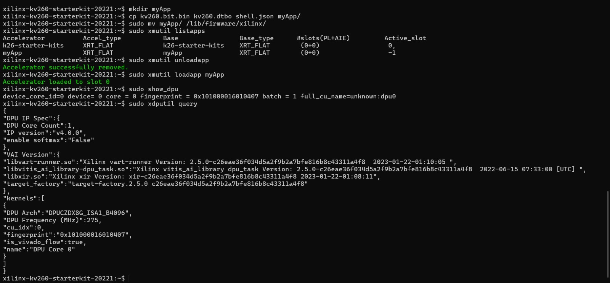

# 🚀 KV260 DPU Demo and Execution

This folder demonstrates the **loading, execution, and verification** of a custom DPU application (`myApp`) on the Xilinx Kria KV260 Starter Kit, along with running an object detection script.

---

## 📌 Overview

This workflow includes:

- Loading the DPU application (`myApp`)
- Verifying DPU status
- Running object detection using a Python script

---

## ⚙️ Prerequisites

- Xilinx Kria KV260 Starter Kit  
- Linux environment with root access  
- Installed tools:
  - xmutil  
  - xdputil  
  - show_dpu  
- Python environment with required dependencies  

---

## ▶️ Step 1: Load and Verify DPU

### List Available Applications
```bash
sudo xmutil listapps
```

### Unload Current Application
```bash
sudo xmutil unloadapp
```

### Load Custom Application
```bash
sudo xmutil loadapp myApp
```

---

## 🔍 Step 2: Verify DPU Status

### Option A
```bash
sudo show_dpu
```

### Option B
```bash
sudo xdputil query
```

### 📷 DPU Verification Output


---

## 🧠 Step 3: Run Object Detection

Navigate and run:

```bash
python object_detection.py
```

### 📷 Object Detection Output


---

## 📂 Folder Contents

- `codefiles/` → Contains Python scripts and required files  
- `img/` → Contains output images  
- `object_detection.py` → Main execution script  

---

## ✅ Result

- DPU application (`myApp`) loaded successfully  
- DPU verified and ready  
- Object detection script executed  

---

## 📌 Notes

- Use `sudo` for hardware-related commands  
- Ensure all dependencies are installed before running Python script  
- Output may vary depending on configuration  

---

## 👨‍💻 Usage

This folder is part of a larger project and is intended for **demo and execution purposes only**.
